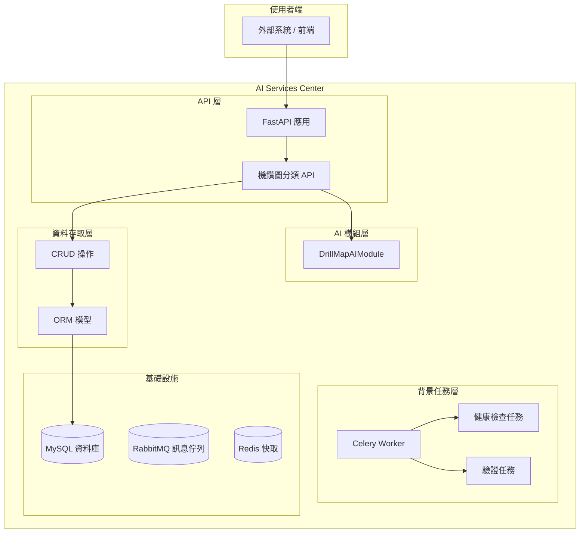

# AI Services Center

[](https://www.python.org/downloads/)
[](https://fastapi.tiangolo.com/)
[](https://opensource.org/licenses/MIT)

AI Services Center 是一個基於 FastAPI 開發的 AI 服務平台，專門用於管理和部署各種 AI 預測服務。目前主要提供機鑽圖異常分類功能，並整合了 Celery 背景任務系統。

## 🎯 功能特色

- **🤖 AI 模組化設計**: 獨立的 AI 模組封裝，支援多模型動態載入
- **⚡ 異步處理**: 基於 FastAPI 的異步 API 處理
- **📊 背景任務系統**: 使用 Celery + RabbitMQ 進行任務佇列管理  
- **💾 資料庫整合**: 支援 MySQL 異步操作與 ORM 模型
- **🔄 自動化任務**: 定時健康檢查與預測記錄驗證
- **📈 監控系統**: Flower 介面監控任務執行狀態
- **🐳 容器化部署**: Docker Compose 一鍵部署

## 🏗️ 系統架構



## 🛠️ 技術堆疊

| 層級 | 技術選型 | 用途 |
|------|----------|------|
| **API 層** | FastAPI + Uvicorn | RESTful API 服務 |
| **AI 處理層** | PyTorch + AutoGluon + cnocr + OpenCV | AI 模型推論與圖像處理 |
| **背景任務** | Celery + RabbitMQ | 異步任務處理 |
| **資料層** | SQLAlchemy + AsyncMy + MySQL | 異步資料庫操作 |
| **快取層** | Redis | 結果快取與 Celery 後端 |
| **容器化** | Docker + Docker Compose | 服務部署與管理 |

## 🚀 快速開始

### 方法一：Docker Compose 部署（推薦）

1. **確保已安裝 Docker 和 Docker Compose**

2. **啟動服務**：
   ```bash
   # 複製專案
   git clone <repository-url>
   cd ai_service_center
   
   # 啟動所有服務
   docker-compose up -d
   ```

3. **驗證服務**：
   - API 服務: http://localhost:8009
   - API 文件: http://localhost:8009/docs  
   - Flower 監控: http://localhost:5555
   - RabbitMQ 管理: http://localhost:15672 (guest/guest)

### 方法二：手動啟動

1. **環境需求**：
   ```bash
   # 檢查 Python 版本
   uv python list --only-installed
   
   # 安裝指定版本（如需要）
   uv python install 3.10.13
   uv python pin 3.10.13
   ```

2. **建立虛擬環境**：
   ```bash
   # 建立虛擬環境
   uv venv --python=3.10.13
   
   # 安裝相依套件
   uv pip install -r requirements.txt
   ```

3. **設定環境變數**：
   ```bash
   # 複製環境變數模板
   cp .env.example .env
   
   # 編輯 .env 檔案設定資料庫連線等資訊
   ```

4. **啟動服務**：
   ```bash
   # 啟動 FastAPI 應用
   uv run main.py
   
   # 另開終端啟動 Celery Worker
   celery -A app.tasks.celery_app worker --loglevel=info
   
   # 另開終端啟動 Celery Beat（定時任務）
   celery -A app.tasks.celery_app beat --loglevel=info
   ```

## 📋 API 說明

### 機鑽圖分類 API

**端點**: `POST /drill_map/classify`

**請求格式**:
```json
{
    "img_src": "/path/to/image.jpg",
    "product_name": "A287570"
}
```

**回應格式**:
```json
{
    "code": "0",
    "error": "",
    "data": {
        "classification_code": "TYPE0",
        "classification_model": "A287570_",
        "distance": 34.691369
    }
}
```

**分類代碼說明**:
- `TYPE0`: 正常
- `TYPE1`: 異常類型1  
- `TYPE3`: 異常類型3
- `TYPE4`: 異常類型4
- `N/A`: 圖片不存在
- `UNKNOW`: 超過距離範圍
- `ERROR`: 處理錯誤

### 健康檢查 API

**端點**: `GET /drill_map/test_sync_call`

用於測試資料庫連線狀態。

## 🔧 配置說明

### 環境變數

建立 `.env` 檔案並設定以下變數：

```env
# MySQL 設定
MYSQL_USER=your_username
MYSQL_PASSWORD=your_password
MYSQL_HOST=192.168.0.101
MYSQL_PORT=3306
MYSQL_DATABASE=tid_5940

# Redis 設定  
REDIS_HOST=localhost
REDIS_PORT=6379
REDIS_PASSWORD=your_password
REDIS_DB=0

# RabbitMQ 設定
RABBITMQ_HOST=localhost
RABBITMQ_PORT=5672
RABBITMQ_USER=guest
RABBITMQ_PASSWORD=guest

# 應用程式設定
APP_ENV=development
APP_DEBUG=True
APP_HOST=0.0.0.0
APP_PORT=8009
```

### Celery 任務設定

目前已設定的定時任務：

- **健康檢查**: 每 5 分鐘檢查資料庫連線
- **API 測試**: 每 3 分鐘測試同步調用
- **預測驗證**: 手動觸發或按需執行

## 🧪 開發與測試

### 專案結構

```
ai_service_center/
├── app/                          # 主應用程式
│   ├── ai_modules/              # AI 模組
│   │   └── drill_map_ai/        # 機鑽圖 AI 模組
│   ├── api/                     # API 路由
│   ├── crud/                    # 資料庫 CRUD 操作
│   ├── database/                # 資料庫連線設定
│   ├── models/                  # ORM 模型
│   ├── services/                # 服務層
│   ├── tasks/                   # Celery 任務
│   ├── tests/                   # 測試檔案
│   └── utils/                   # 工具函式
├── docker-compose.yml           # Docker 編排設定
├── requirements.txt             # Python 相依套件
├── pyproject.toml              # 專案設定
└── main.py                     # 應用程式入口
```

### 執行測試

```bash
# 執行單元測試
uv run -m pytest app/tests/

# 執行 AI 模組測試
uv run -m pytest app/ai_modules/drill_map_ai/tests/
```

## 📊 監控與維運

### Flower 監控介面

訪問 http://localhost:5555 查看：
- 任務執行狀態
- Worker 節點資訊
- 任務執行歷史
- 效能統計資料

### RabbitMQ 管理介面

訪問 http://localhost:15672 查看：
- 佇列狀態
- 訊息統計
- 連線資訊
- 效能指標

### 日誌查看

```bash
# 查看 Docker 容器日誌
docker-compose logs -f

# 查看特定服務日誌
docker-compose logs -f rabbitmq
docker-compose logs -f flower
```

## 🔄 停止服務

### Docker Compose

```bash
# 停止所有服務
docker-compose down

# 停止並移除資料卷
docker-compose down -v
```

### 手動停止

使用 `Ctrl+C` 停止各個服務進程。

## 🤝 貢獻指南

1. Fork 專案
2. 建立功能分支 (`git checkout -b feature/amazing-feature`)
3. 提交變更 (`git commit -m 'Add amazing feature'`)
4. 推送分支 (`git push origin feature/amazing-feature`)
5. 開啟 Pull Request

## 📝 版本歷程

### v0.1.0 (Current)
- ✅ 基礎 FastAPI 框架
- ✅ 機鑽圖 AI 分類功能
- ✅ Celery 背景任務系統
- ✅ MySQL 資料庫整合
- ✅ Docker 容器化部署
- ✅ Flower 監控介面

### 未來規劃
- 🔄 Redis 快取整合
- 🔄 FTP 自動同步任務
- 🔄 更多 AI 模組擴展
- 🔄 Prometheus + Grafana 監控
- 🔄 Kubernetes 部署支援

## 📞 支援與聯絡

如有問題或建議，請聯絡開發團隊或建立 Issue。

## 📄 授權條款

本專案採用 MIT 授權條款 - 查看 [LICENSE](LICENSE) 檔案了解詳情。

---

**AI Services Center** - 企業級 AI 服務管理平台 🚀
